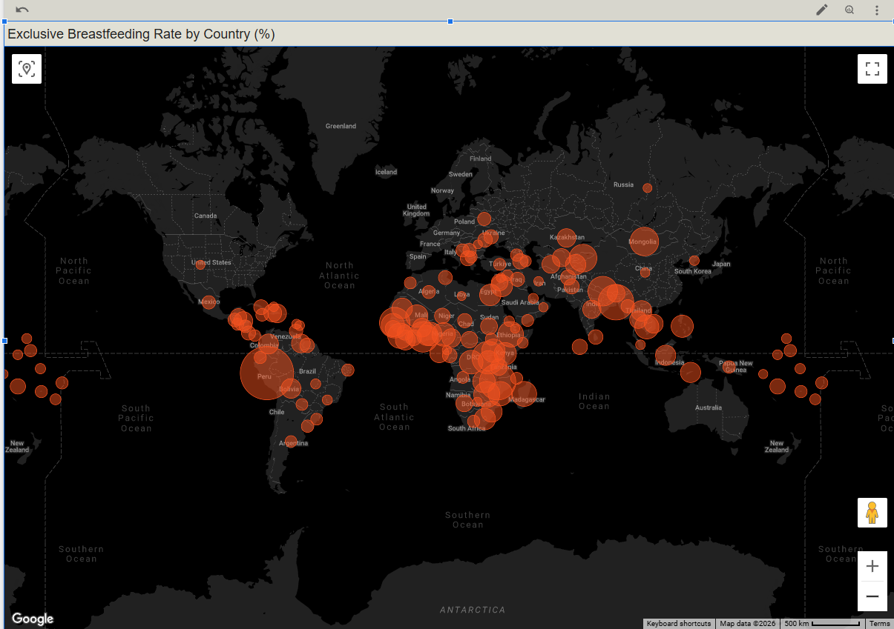
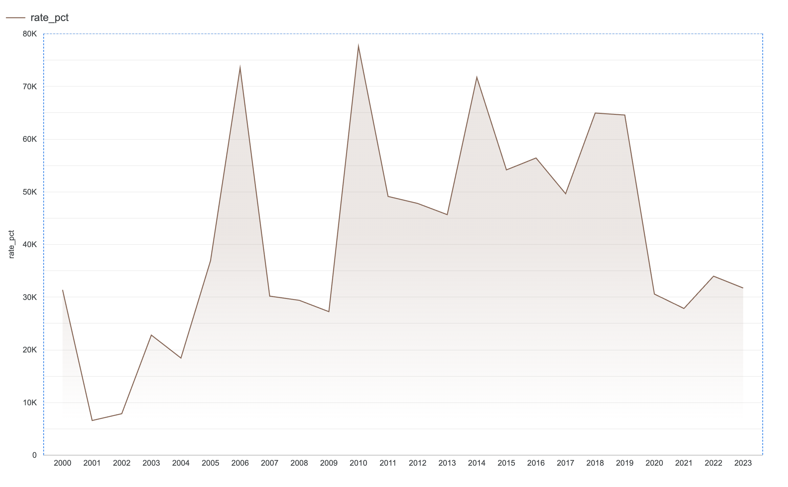

# Global Breastfeeding Analytics Dashboard

An end-to-end data engineering pipeline that ingests, transforms, and visualises
UNICEF infant feeding data to expose gaps in global breastfeeding practices.

---

## Problem Description

Undernutrition is associated with 45% of all child deaths under age 5 globally.
WHO and UNICEF recommend exclusive breastfeeding for the first 6 months of life,
yet only ~44% of infants worldwide were exclusively breastfed between 2015–2020.

This project answers two questions:
1. Which countries have the lowest exclusive breastfeeding rates today?
2. Is the global breastfeeding rate improving over time?

---

## Architecture
```
  UNICEF Data Warehouse (CSV)
  │
  ▼
  [Prefect Batch Pipeline]
  ├── download_data.py      → fetches raw CSV
  ├── upload_to_gcs.py      → stores in GCS data lake
  └── load_to_bigquery.py   → loads into BigQuery raw table
  │
  ▼
  [GCS Bucket]  ← raw zone (data lake)
  breastfeeding-analytics-breastfeeding-lake/raw/breastfeeding/
  │
  ▼
  [BigQuery — breastfeeding_analytics dataset]
  ├── raw_bf_rates           → raw ingested table
  ├── stg_breastfeeding      → dbt staging view (cleaned)
  └── fact_bf_rates          → dbt mart table (partitioned + clustered)
  │
  ▼
  [Looker Studio Dashboard]
  ├── Tile 1: Geo map — exclusive BF rate by country
  └── Tile 2: Line chart — global BF rate trend 2000–2023
```
---

## Technologies

  | Layer | Tool |
  |---|---|
  | Cloud | Google Cloud Platform (GCP) |
  | Infrastructure as Code | Terraform |
  | Data Lake | Google Cloud Storage (GCS) |
  | Workflow Orchestration | Prefect |
  | Data Warehouse | BigQuery |
  | Transformations | dbt Core + dbt-bigquery |
  | Dashboard | Looker Studio |
  | Language | Python 3.12 |

---

## Dataset

**Source:** UNICEF Global Data Warehouse — Infant and Young Child Feeding Indicators
**URL:** https://data.unicef.org/topic/nutrition/infant-and-young-child-feeding/
**Coverage:** 195 countries, 2000–2023
**Key indicators:**
- `NT_BF_EXBF` — Exclusive breastfeeding rate (infants 0–5 months)
- `NT_BF_EIBF` — Early initiation of breastfeeding (within 1 hour of birth)

**Raw size:** 21,808 rows × 40 columns

---

## Data Warehouse Design

`fact_bf_rates` is **partitioned by `year`** (range 2000–2025) and
**clustered by `indicator_code` and `country_code`**.

This means:
- Dashboard queries filtering by year scan only the relevant partition
  instead of the full table — reducing cost and latency.
- Clustering by indicator then country means the two dashboard tiles
  (one per indicator, filtered by country) each hit a single cluster
  segment.

---

## Key Findings

**Geo map (Tile 1):** Exclusive breastfeeding rates are highest across
Sub-Saharan Africa and South/Southeast Asia — particularly Rwanda, Burundi,
Sri Lanka, and Cambodia consistently exceed 80%. North America, Europe, and
parts of the Middle East show the lowest rates, many below 20%, indicating
a strong correlation between high-income economies and lower breastfeeding
rates — likely driven by formula marketing, shorter maternity leave policies,
and cultural norms.

**Trend line (Tile 2):** Global data coverage has expanded significantly
since 2000, with the number of country-year observations growing from under
10,000 to over 75,000 by 2010. Average exclusive breastfeeding rates have
shown modest improvement globally but remain well below the WHO target,
with high variance between regions indicating that progress is uneven and
concentrated in specific geographies.

The data reinforces WHO's position that scaling exclusive breastfeeding to
90% globally could prevent over 820,000 child deaths annually.

---

## Setup & Reproduction

### Prerequisites
- Google Cloud account with billing enabled
- Python 3.10+
- Terraform installed
- `gcloud` CLI installed and authenticated

### Steps

**1. Clone the repository**
```bash
git clone https://github.com/YOUR_USERNAME/breastfeeding-analytics.git
cd breastfeeding-analytics
```

**2. Authenticate with GCP**
```bash
gcloud auth login
gcloud config set project breastfeeding-analytics
gcloud auth application-default login
```

**3. Provision infrastructure**
```bash
cd terraform
echo 'project_id = "breastfeeding-analytics"' > terraform.tfvars
terraform init
terraform apply
cd ..
```

**4. Install dependencies**
```bash
pip install -r requirements.txt
```

**5. Set environment variables**
```bash
export GCS_BUCKET="breastfeeding-analytics-breastfeeding-lake"
export GCP_PROJECT="breastfeeding-analytics"
```

**6. Run the full pipeline**
```bash
PYTHONPATH=. python -m orchestration.pipeline_flow
```

This runs all four steps in sequence:
- Downloads UNICEF CSV
- Uploads to GCS
- Loads into BigQuery
- Runs dbt transformations

**7. Run dbt standalone (optional)**
```bash
cd dbt_transform
dbt deps
dbt run --project-dir . --profiles-dir .
```

---

## Dashboard

🔗 [View Live Dashboard](https://datastudio.google.com/reporting/218267fc-04ba-4c71-9652-3fe77de93bc0)




---

## Project Structure
```
  breastfeeding-analytics/
  ├── terraform/              # IaC — provisions GCS + BigQuery
  ├── ingestion/              # Python scripts — download + GCS upload
  ├── orchestration/          # Prefect flow — full pipeline DAG
  ├── dbt_transform/          # dbt models — staging + mart
  │   └── models/
  │       ├── staging/        # stg_breastfeeding (view)
  │       └── marts/          # fact_bf_rates (partitioned table)
  ├── dashboard/              # Screenshots of Looker Studio tiles
  ├── requirements.txt
  └── README.md
```
---

## Course

DataTalksClub Data Engineering Zoomcamp — Final Project
